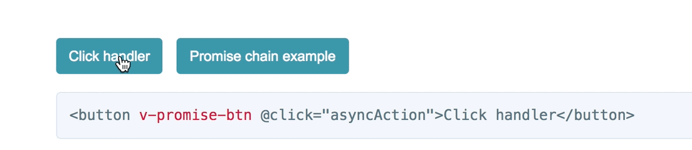

# vue-promise-btn

[](https://www.npmjs.com/package/vue-promise-btn)
[](https://www.npmjs.com/package/vue-promise-btn)

## Example and Documentation
https://STUkh.github.io/vue-promise-btn/

<div style="text-align:center" align="center">
    
</div>

## Features
- Easy-to-use API
- Works with any tag and even forms
- Packaged with optional built-in spinner
- Only 1.5KB minified and gzipped
- ESM, CommonJS, UMD versions

### Installation
```
npm install --save vue-promise-btn
```
#### Quick Start:
- Import and "handshake" plugin with vue
```javascript
import Vue from 'vue'
import VuePromiseBtn from 'vue-promise-btn'

// not required. Styles for built-in spinner
import 'vue-promise-btn/dist/vue-promise-btn.css'

Vue.use(VuePromiseBtn) // or with global options Vue.use(VuePromiseBtn, {})
```

- Use in components
``` <button v-promise-btn @click="getData">Get Data</button> ```

## Change log

Please see [CHANGELOG](CHANGELOG.md) for more information what has changed recently.

## Contributing

Please see [CONTRIBUTING](CONTRIBUTING.md) and [CONDUCT](CONDUCT.md) for details.

## Credits

- [Alex Stepchenkov](https://github.com/STUkh)
- [All Contributors](https://github.com/STUkh/vue-promise-btn/graphs/contributors)

## License

The MIT License (MIT). Please see [License File](LICENSE.md) for more information.

&copy; [STUkh](https://github.com/STUkh) <stukak@gmail.com>
